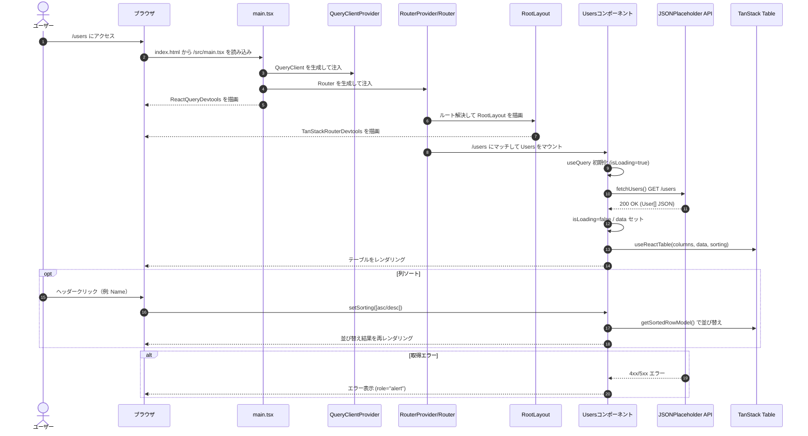
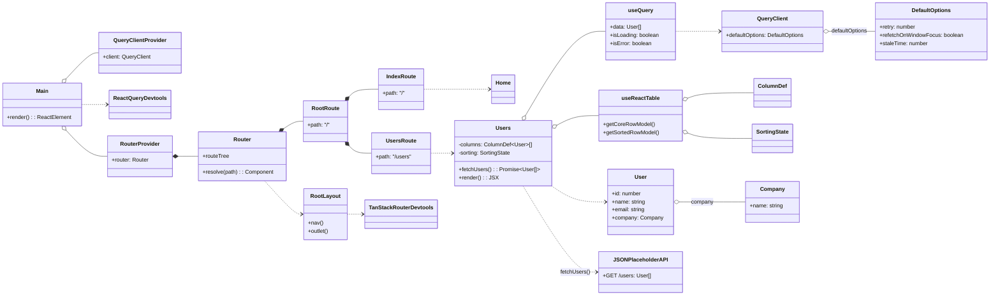

# TanStack JS PoC (Vite + React + TypeScript)

最小構成の PoC。TanStack Router / React Query / React Table を使用。

## セットアップ

- 必要: Node.js 18 以上
- 依存関係のインストール:

```bash
npm install
```

## 開発サーバ起動

```bash
npm run dev
```

- ブラウザで http://localhost:5173 を開く
- 画面:
  - `/` Home
  - `/users` Users（JSONPlaceholder から取得し、name/email/company.name を表示。列はソート可）

## スクリプト

- `npm run dev` 開発サーバ
- `npm run build` ビルド
- `npm run preview` ローカルプレビュー
- `npm run test` テスト実行（Vitest + React Testing Library）
- `npm run lint` ESLint チェック
- `npm run format` Prettier 整形
- `npm run typecheck` 型チェック

## 技術メモ

- ルーティング: TanStack Router の code-based 構成（Vite プラグイン不要）。`src/router.tsx`
- データ取得: React Query（`src/shared/queryClient.ts` で `QueryClientProvider` を提供）。
  - React Query Devtools 有効化済み。
- Users テーブル: TanStack Table v8 でソート対応。
- テスト: `src/pages/Users.test.tsx` にローディング→成功のスモークテストを1件追加。
- 型: `src/types/user.ts` に `User` 型を定義し厳格に利用。

## sequenceDiagram


## classDiagram

